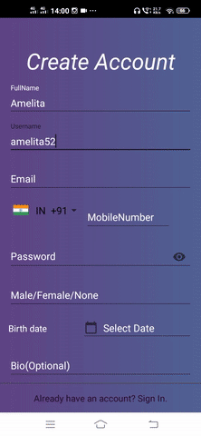
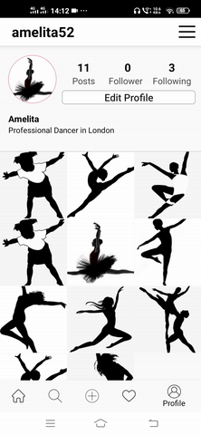
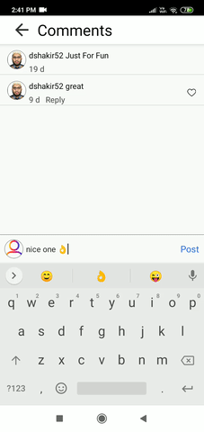

# Instagram-clone

## Installation Guide
1. Clone repository
2. Open the Project in your android studio
3. IMPORTANT:- Change the [PackageName](https://stackoverflow.com/questions/16804093/android-studio-rename-package)
4. Create Firebase [project](https://console.firebase.google.com/).
5. [Connect](https://youtu.be/ggMPCD9hlaQ) Firebase with Android Studio.
6. Download the file google-service.json from firebase project setting and import into your project
7. IMPORTANT FOR NOTIFICATION:- Copy Server key from Firebase/Project Setting/cloudmessaging/ and paste it in APIService.java class

## Connect with me:

.

## Features
1. Login, Signup,Logout,Forgot password (with email verification)
2. Quick Login like in Facebook and Instagram (this means app remembers that you had logged in).
3. Follow, Unfollow, Profile views.
4. Post photo posts from camera or gallery
   * Like posts
      * View all likes on a post
   * Comment on posts
        * View all comments on a post
5. Edit your profile (username, Bio, social links,Name).
6. Conversation with your freinds.
7. Message emoji, Text.
8. Get Notifications.
9. Search for users
    * Search based on usernames
10. Post Story from camera or gallery
      * Views
        * View all Views on a Story
      * Delete
        * Delete Story
11. Offline Capability

## Screenshots
#### Registration | Login
|  | 
   |

#### Profile | Edit Profile | Account Setting
| ||  
||

#### Search User | User Profile | User Post
|||||

#### Home feed | Seen/Unseen Story
|  ||

#### Comment | Post Photo | Notification Panel
| ||

#### Conversation | Push Notification
|||

#### Firebase Database

#### Firebase Storage

## Technology Used
* Android Studio
* Firebase

## Language Used
* Java

## Module used
* [Cardview](https://developer.android.com/jetpack/androidx/releases/cardview)
* [Retrofit](https://github.com/square/retrofit)
* [Image Croper](https://github.com/ArthurHub/Android-Image-Cropper)
* [StoriesProgressView](https://github.com/shts/StoriesProgressView)
* [Glide](https://github.com/bumptech/glide)
* [Country Code Picker](https://github.com/hbb20/CountryCodePickerProject)
* [Universal image loader](https://github.com/nostra13/Android-Universal-Image-Loader)
* [Circle Image View](https://github.com/hdodenhof/CircleImageView)

## Copyright claims
Many images used in the project belong to their respective creators/authors. No claim by me & those who use this project!!

## How to Contribute
Show your support by 🌟 the project!!

* Fork the the project
* Create your feature branch (git checkout -b my-new-feature)
* Make required changes and commit (git commit -am 'Add some feature')
* Push to the branch (git push origin my-new-feature)
* Create new Pull Request

Feel free to contribute!

## License
InstagramClone is available under the [MIT License](LICENSE), see LICENSE for more infomation.
